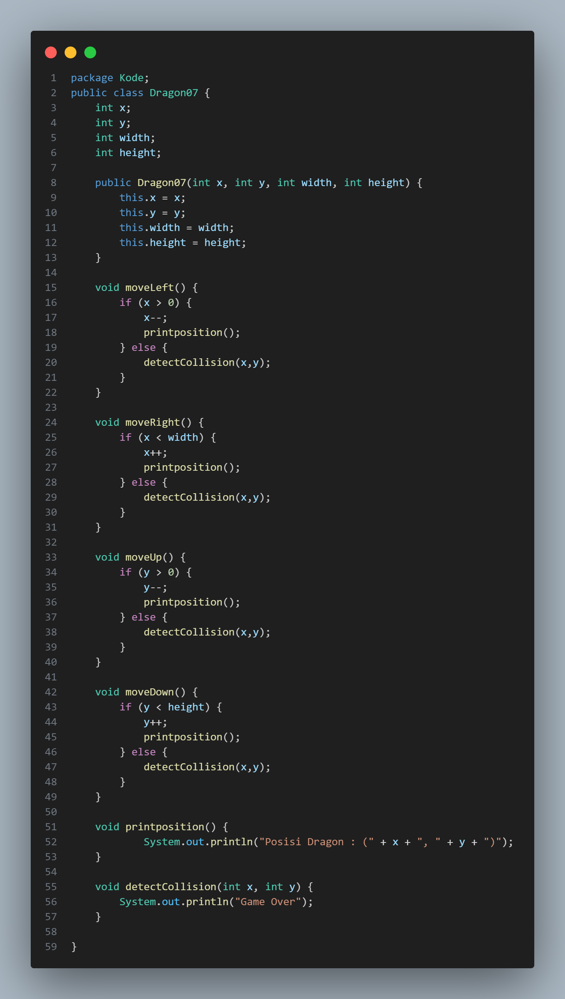

# 
  LAPORAN PRAKTIKUM ALGORITMA DAN STRUKTUR DATA 
 
    

    

     

 Nama  : Chiko Abilla Basya 

 NIM   : 2341720005 

 Prodi : TEKNIK INFOMATIKA

 Kelas : 1B 

     

<h2>2. Praktikum  
<h3>2.1 Percobaan 1: Deklarasi Class, Atribut dan Method

<h3>2.1.1 Langkah-langkah Percobaan 

<h3>2.1.2 Verifikasi Hasil Percobaan

  

<h3>2.1.3 Pertanyaan  
<h4>1.	Sebutkan dua karakteristik class atau object!  
Jawab :  - Class adalah sebuah konsep abstrak yang tidak dapat diakses secara langsung oleh program. Class hanya dapat diwujudkan melalui pembuatan objek. Class juga dapat dianggap sebagai sebuah tipe data yang dapat dibuat sendiri oleh programmer .  
- Object adalah sebuah entitas yang memiliki identitas, keadaan, dan perilaku. Identitas adalah nama atau referensi yang menunjuk ke objek. Keadaan adalah nilai dari properti yang dimiliki objek. Perilaku adalah aksi yang dapat dilakukan objek melalui metode . 
2.	Perhatikan class Buku pada Praktikum 1 tersebut, ada berapa atribut yang dimiliki oleh class Buku? Sebutkan apa saja atributnya!  
Jawab :  
Di class buku ada 5 atribut yaitu String (judul), String (pengarang), int halaman, int (stok), int (harga).  
3.	Ada berapa method yang dimiliki oleh class tersebut? Sebutkan apa saja methodnya!   
Jawab :  
di class buku ada 5 method yaitu tampilInformasi(), terjual(), gantiHarga(), tampilInformasi(), restock(). 
4.	Perhatikan method terjual() yang terdapat di dalam class Buku. Modifikasi isi method tersebut sehingga proses pengurangan hanya dapat dilakukan jika stok masih ada (lebih besar dari 0)!  
Jawab :  

  
5.	Menurut Anda, mengapa method restock() mempunyai satu parameter berupa bilangan int?  
Jawab :  
Method restock() memiliki satu parameter berupa bilangan int karena parameter tersebut digunakan untuk menentukan jumlah tambahan stok yang akan diinputkan. Jumlah tambahan stok harus berupa bilangan bulat, dan menggunakan tipe data int adalah pilihan yang tepat untuk merepresentasikan bilangan bulat dalam Java. Dengan demikian, penggunaan tipe data int sebagai parameter untuk method restock() memungkinkan pengguna untuk dengan mudah menambahkan jumlah stok yang diinginkan. 
6. Commit dan push kode program ke Github  

     
<h3>2.2 Percobaan 2: Instansiasi Object, serta Mengakses Atribut dan Method  
<h3>2.2.1 	Langkah-langkah Percobaan

<h3>2.2.2 	Verifikasi Hasil Percobaan 

<h3>2.2.3 	Pertanyaan 
<h4>1.	Pada class BukuMain, tunjukkan baris kode program yang digunakan untuk proses instansiasi! 
Apa nama object yang dihasilkan?   
Jawab :  
Buku07 bk1 = new Buku07();  
2.	Bagaimana cara mengakses atribut dan method dari suatu objek?  
Jawab :  
Untuk mengakses atribut dan method dari suatu objek, perlu menggunakan nama objek yang telah diinstansiasi, diikuti oleh tanda titik (.). Untuk mengakses atribut dari objek, menggunakan namaObjek.namaAtribut. Sedangkan untuk memanggil method dari objek, menggunakan namaObjek.namaMethod().  
3.	Mengapa hasil output pemanggilan method tampilInformasi() pertama dan kedua berbeda?  
Jawab :  
Perubahan nilai atribut objek antara pemanggilan method menyebabkan perbedaan output. 
     

<h3>2.3 Percobaan 3: Membuat Konstruktor  
<h3>2.3.1 	Langkah-langkah Percobaan 

<h3>2.3.2 	Verifikasi Hasil Percobaan 

<h3>2.3.3 	Pertanyaan 
<h4>1.	Pada class Buku di Percobaan 3, tunjukkan baris kode program yang digunakan untuk mendeklarasikan konstruktor berparameter!  
Jawab :  

 
    
2.	Perhatikan class BukuMain. Apa sebenarnya yang dilakukan pada baris program berikut?   
Jawab :  
Pada baris program tersebut, sebuah objek bk2 dari class Buku07 dibuat menggunakan konstruktor berparameter. Nilai-nilai yang diperlukan untuk inisialisasi objek bk2 disediakan sebagai argumen untuk konstruktor tersebut.  
3.	Hapus konstruktor default pada class Buku, kemudian compile dan run program. Bagaimana hasilnya? Jelaskan mengapa hasilnya demikian!  
Jawab :  
akan mendapatkan error  

  

karena menghapus konstruktor default, Java tidak lagi menyediakan konstruktor default secara otomatis.  
4.	Setelah melakukan instansiasi object, apakah method di dalam class Buku harus diakses secara berurutan? Jelaskan alasannya!  
Jawab :  
Tidak Harus, karena agar tidak ada ketergantungan urutan pemanggilan antar method di dalam class tersebut.  
5.	Buat object baru dengan nama buku<NamaMahasiswa> menggunakan konstruktor berparameter dari class Buku!   
Jawab :  

  
6.	Commit dan push kode program ke Github 
     

<h3>2.4 Latihan Praktikum
<h4>1. Soal 1  
Jawab :  

 
Hasil Program  

 

<h4>2. Soal 2  
Jawab :  

  

Hasil program  

